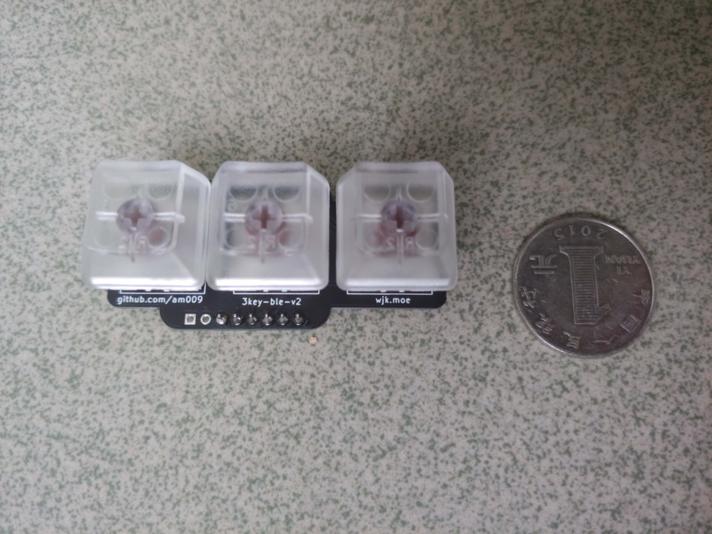
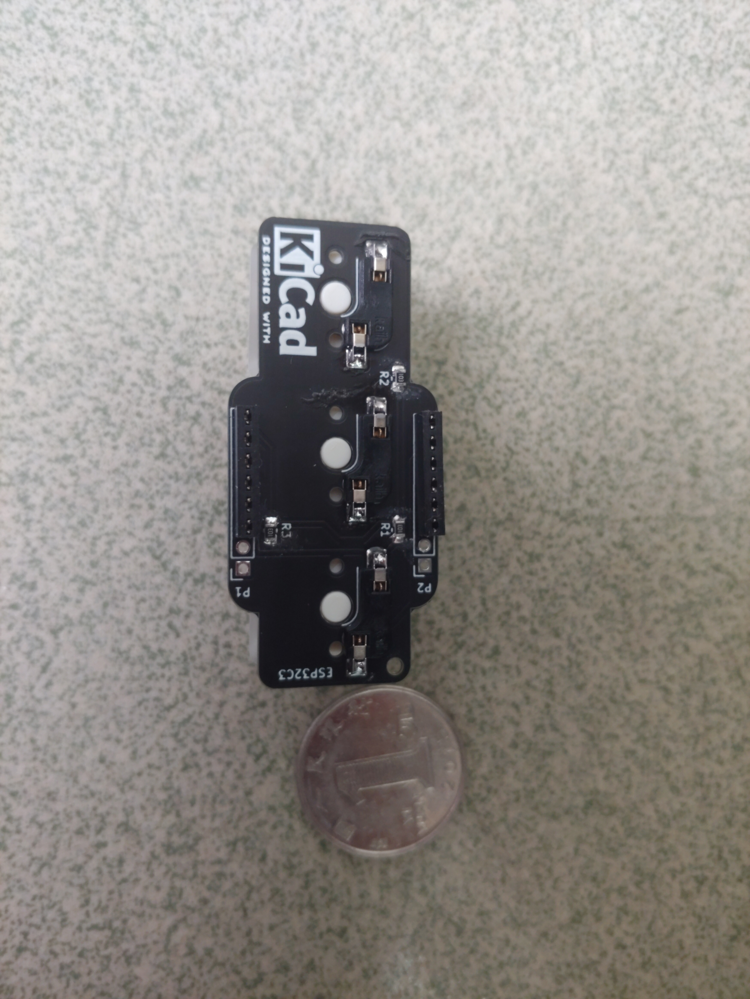
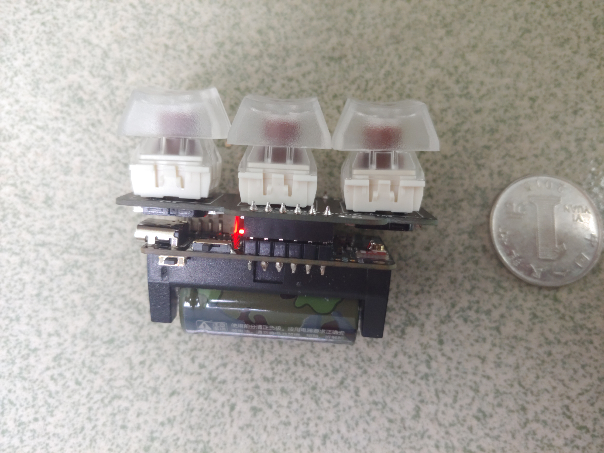
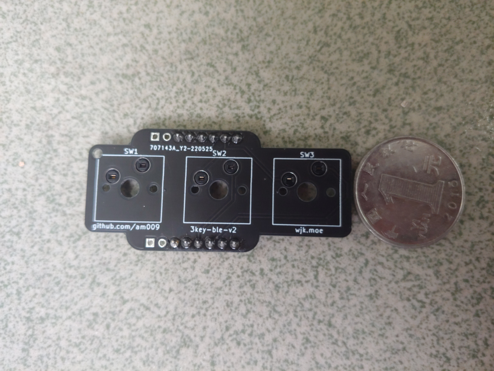
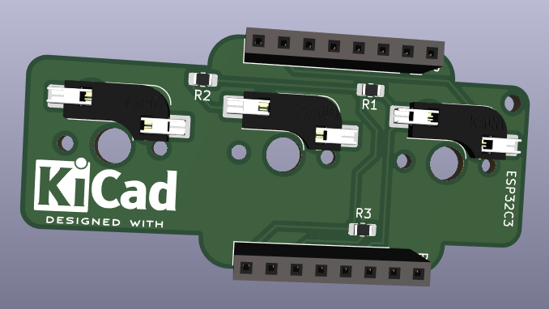
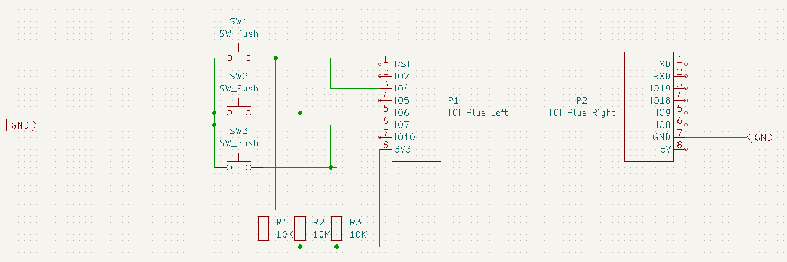

# 3-key-ble-v2

Tiny 3-key ble keyboard. Based on https://github.com/Xinyuan-LilyGO/LilyGo-T-OI-PLUS

基于https://github.com/Xinyuan-LilyGO/LilyGo-T-OI-PLUS 画简单的拓展板，满足自己3键蓝牙键盘需求。通过排针排母连接

### feature

- kailh hotswap sockets
- simple pcb, simple code, easy to understand

### photos

### 笔记

https://github.com/espressif/arduino-esp32 首先搞一下开发环境。https://docs.espressif.com/projects/arduino-esp32/en/latest/getting_started.html 这里跟着做一下。

https://github.com/wakwak-koba/ESP32-NimBLE-Keyboard 这人改装了一下。但是原来的库：https://github.com/T-vK/ESP32-BLE-Keyboard 这个已经merge了那个NimBLE库的支持，只需要启用一下。那我直接用就可以了应该。

【！！】解决按键上拉的问题：https://github.com/espressif/arduino-esp32/discussions/6197 c3不支持captive touch怎么办。。。pcb上加上拉电阻吧。

https://www.reddit.com/r/olkb/comments/ckbprk/kicad_footprint_for_kaihl_hotswap_socket_and/ 这个人说https://github.com/ai03-2725/MX_Alps_Hybrid 有hotswap sockets。https://github.com/perigoso/keyswitch-kicad-library 这里发现也有。用这个了。直接Plugin and Content Manager在KiCAD里面直接下载。

https://www.bookstack.cn/read/kicad-5.1.5-zh/OEBPS-ch05s04.html KiCAD的中文教程书

https://haipeng.me/2017/03/01/kicad-tutorial/ 另一个完整的教程

### 电路板

安装Kicad先，然后先选择引脚，画原理图。正反千万别弄错。

引脚选择看：https://docs.espressif.com/projects/esp-idf/zh_CN/latest/esp32c3/api-reference/peripherals/gpio.html 

其中Strapping pin好像是和开机启动进入不同模式有关。可以考虑避开。好像有些要求所以板子其实有对IO8上拉。但是查了下NC表示空贴，意思是其他的都空贴了。仔细观察了一下，看了半天，确实有5个空的电阻位子。看来上拉电阻一般都用10k。然后我也默认上拉，按下按钮的时候被下拉。

RTC应该不用管，我直接开关断电还是最好的。

最终选择的IO：GPIO 4、6、7

### 创建元件

创建TOI-plus的元件symbol和footprint。应该是配套的库，一个是原理图上的，一个是PCB上的。

google搜索kicad add project specific symbol，我参考的是https://www.protoexpress.com/blog/how-to-create-a-schematic-and-symbol-library-kicad/ 

unit好像指的是一个symbol分很多不同部件。所以应该不用管，选1。然后注意观察其他的元件是怎么画的，画一个框然后放好点位就可以了。为了方便后面map到排母的footprint，分两个symbol画。不要分两个unit（因为好像只能一个symbol map一个footprint）。

下载的时候那个键盘库只有footprint。所以原理图就用SW_Push简单的按钮代替。

上拉参考下面的这个。贴片电阻map的时候暂时选用0603。

无语，安装了结果路径没有加到footprint库。还得我手动加。"C:\Users\xxx\Documents\KiCad\6.0\3rdparty\footprints\com_github_perigoso_keyswitch-kicad-library\Switch_Keyboard_Hotswap_Kailh.pretty"

plated后缀的区别在于：https://www.pcbunlimited.com/engineering/plated-non-plated-through-holes NPTH的洞和PTH的洞。其实就是看你要不要洞里带焊锡。那还是带着吧。好像是PTH是正常的过孔，不需要额外收费的。

### PCB

原理图搞正确后直接选tools update from schematic就直接出来元件和指示线了。

加的测量线的名字叫dimension。摆好元件后就可以

嘉立创的注意事项在https://www.jlc.com/portal/vtechnology.html 然后到net class里可以改。用默认值就可以。

https://blog.csdn.net/qq_52940987/article/details/124570167 选择线宽线距

https://www.cnblogs.com/F4NNIU/p/10495105.html 画板框

创建了覆铜区域之后铜没上去，右键点zone->fill zone才覆上去了。

最小字符宽6mil=0.1524mm，字符高40mil=1.016mm。还说是极限值。。

https://www.jlc.com/portal/t6i403.html 嘉立创客户编号。算了，占掉靠外的位置，让他们随便加吧

https://www.chenxublog.com/2021/10/08/kicad-jlc-gerber.html 生成生产文件。

### 硬件购买

键盘轴，热拔插座，16340 3.7v电池，矮排针，贴片电阻，

量一下3d模型里面热拔插座的厚度，应该是顶在typec接口上面，防止插不进去甚至还要多留一点

下面留5.5mm，热拔插座1.85mm算1.9，typc母算3.5mm。那两PCB间考虑留5.5-6.5mm。排针塑高快2mm。。。那买3.5的和5的都来试试吧。最后发现3.5mm排针刚好合适，甚至还多有一点点位置。

最后翻车的两点：8pin排针买成了6pin。忘了买镊子。。。还好后面找到了个。0805贴片电阻还是有点难焊啊。注意焊接排针排母的时候，（焊完一边焊另一边的时候）考虑把整个（排针和排母）接起来再焊接，防止微小的公差导致对接的时候焊盘受力。

### 软件

为了按键防抖，30ms后采样。用最简单的方法ISR里去设置bool值为真，然后用死循环，如果那边bool变化了，就sleep 30ms后对对应的按键状态进行采样，然后更新一下BLE键盘的按键状态。突然发现example里面有个functional interrupt，写得非常清晰。

开发环境大概就是，安装arduino，然后根据教程安装esp32系列板子，然后安装ESP32-BLE-Keyboard库。最后记得启用里面的NimBLE mode，Uncomment the first line in BleKeyboard.h。

1.	实现一个按下按键串口打印的框架。
2.	对接蓝牙键盘库。
3.	处理电量指示。唯一有点复杂的地方：https://github.com/Xinyuan-LilyGO/LilyGo-T-OI-PLUS/issues/19 

最终代码在arduino/main/main.ino。非常简单。上次搞得太复杂了。

### 总结

第二次做有一些经验了，最早想自己完整设计板子的，无奈电池管理模块什么的还是太难了。

希望这次基于ESP32C3这个RISC-V的板子能够续航更长，热拔插键轴也更方便更换。屏幕果然完全不需要，还是省电比较重要，电池电量完全可以通过蓝牙在主机端显示

欢迎邮件交流。

上次的板子在：https://github.com/am009/my-3key-ble-keyboard
